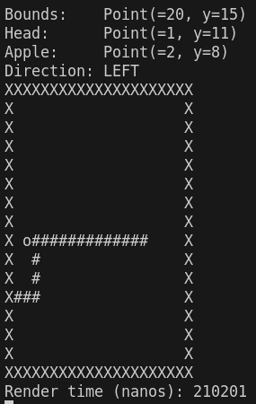

# snake++

This is a simple implementation of the video game [Snake](https://en.wikipedia.org/wiki/Snake_(1998_video_game)).

## How to run

This application only works on Linux. If you use Windows, use WSL.

Make sure you have these dependencies installed:
- CMake
- Make
- Ncurses
- A C++ compiler

Then run:
- `cmake .`
- `make`
- `./snake`

## How to play

Use your arrow keys. Don't hit the level boundaries. Don't hit your tail.
